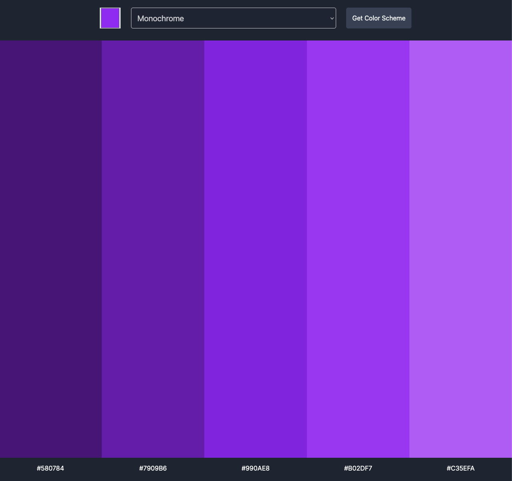

# Color Scheme Generator

A single page application that generates color schemes based on a selected color. This project utilizes HTML, CSS, JavaScript, and the Color API to fetch and display a harmonious color palette.

## Features

- Select a base color using the color picker.
- Fetches a color scheme based on the selected color using the Color API.
- Displays the generated color scheme visually.
- Copy color codes for easy use in design and development projects.

## Technologies Used

- HTML: Structure of the application.
- CSS: Styling for an intuitive and visually appealing UI.
- JavaScript: Handles user interactions and API requests.
- The Color API: Fetches color schemes based on the selected base color.

## How to Use

1. Open the application in a browser: https://colors-schemes-generator.netlify.app
2. Select a base color using the color input field.
3. Use the selector to change the color scheme type (e.g., complementary, monochromatic) and explore different palette variations.
4. Click the "Get Color Scheme" button.
5. View the generated color scheme displayed on the page.
6. Click on any color or its hex code value to copy the hex code to your clipboard.

## Preview

## Acknowledgments

Thank you to [The Color API](https://www.thecolorapi.com) for providing the color scheme data!
